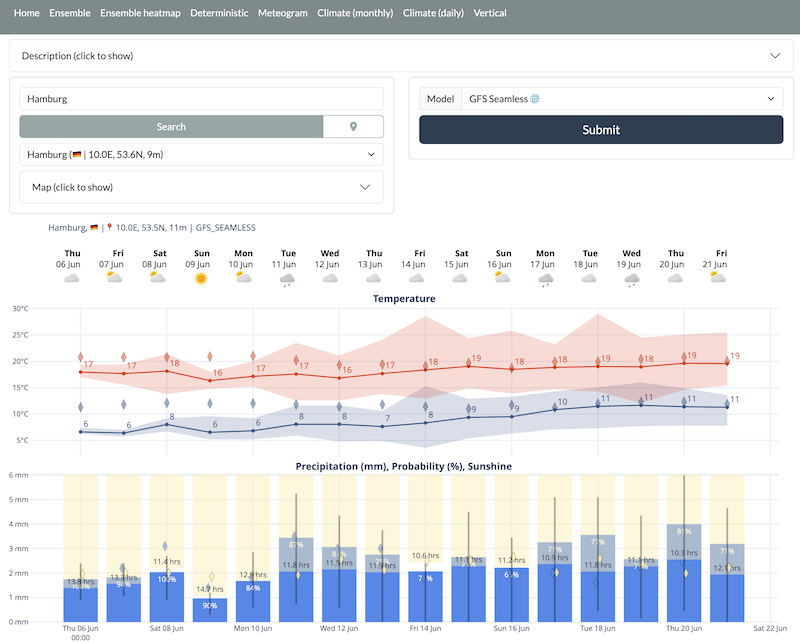
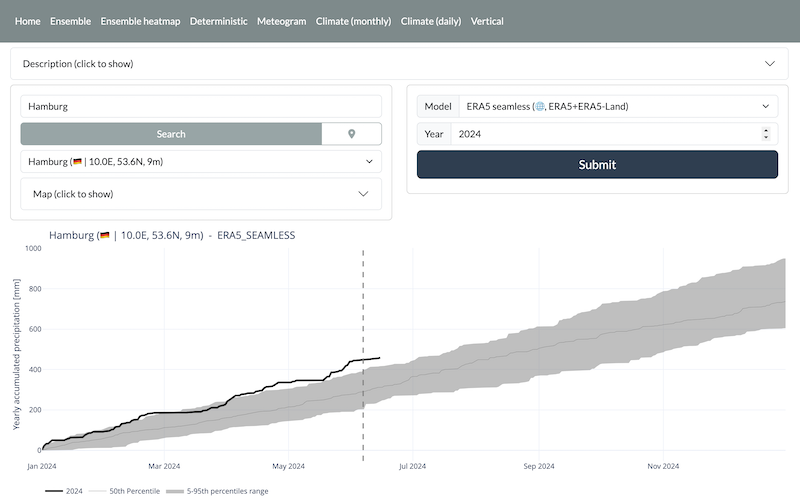
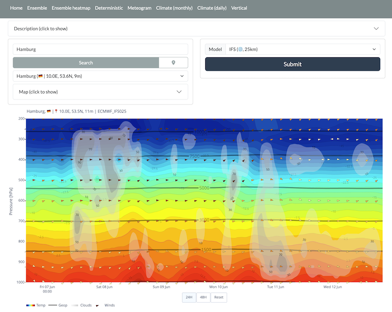

# point_wx

This is a Dash application that uses the open-meteo APIs (https://open-meteo.com/en/docs) to show some interesting plots.






## Installation
Install the requirements

- `dash`
- `dash-bootstrap-components`, for styling the whole application
- `dash-leaflet`, to show the small map4
- `pandas`, for data manipulation
- `plotly`, for plotting
- `requests`, used to download data from the openmeteo API
- `flask-cache`, used to cache all data functions
- `jdcal`, for `suntimes.py` to work. We use this to show the sunrise/sunset times on the plot.
- `Pillow`, to add weather icons

Sorry, no explicit packaging with `yaml` and/or `requirements.txt` is provided for now.
But since you only need a few packages to make it work, it should be fine. 

## Configuration
You can set the options in `src/utils/settings.py`

- `APP_HOST`, `APP_PORT` will only have effect if you run the `app.py` directly without using another production server like `gunicorn`
- `URL_BASE_PATHNAME` specifies the subfolder where the whole site is running
- `CACHE_TYPE` and `CACHE_DIR` allows you to change the cache behaviour, which is used to save and reuse the results of the function downloading the forecast data in `src/utils/openmeteo_api.py`

## Running
To test just run `python src/app.py`.
To deploy in production something like this should work

```python
gunicorn -b 127.0.0.1:8000 --timeout=90 app:server
```

You can setup a service using `supervisor` and using the following configuration as a `.conf` file

```
[program:point_wx]
directory=/home/ubuntu/point_wx/src/
command=gunicorn -b 127.0.0.1:8000 --timeout=90 app:server
autostart=true
autorestart=true
stopasgroup=true
killasgroup=true
stderr_logfile=/var/log/pointwx/point_wx.err.log
stdout_logfile=/var/log/pointwx/point_wx.err.log
```

Or with systemd 

```
[Unit]
Description=Gunicorn instance to serve point_wx
After=network.target

[Service]
User=user
Group=group
WorkingDirectory=/home/user/point_wx/src
Environment="MAPBOX_KEY=<mapbox-key-for-geocoding-api>"
Environment="OPENMETEO_KEY=<commercial-key-otherwise-free-is-used>"
Environment="REACT_VERSION=18.2.0" # Needed for dash mantine
ExecStart=/bin/bash -c "source /home/user/miniconda3/bin/activate dash && exec gunicorn -b 127.0.0.1:8000 --workers=3 --timeout=90 app:server"
StandardOutput=append:/var/log/pointwx/point_wx.log
StandardError=append:/var/log/pointwx/point_wx.log

[Install]
WantedBy=multi-user.target
```

Or with Docker

```
docker build -t pointwx .
docker run -p 8083:8000 pointwx
```