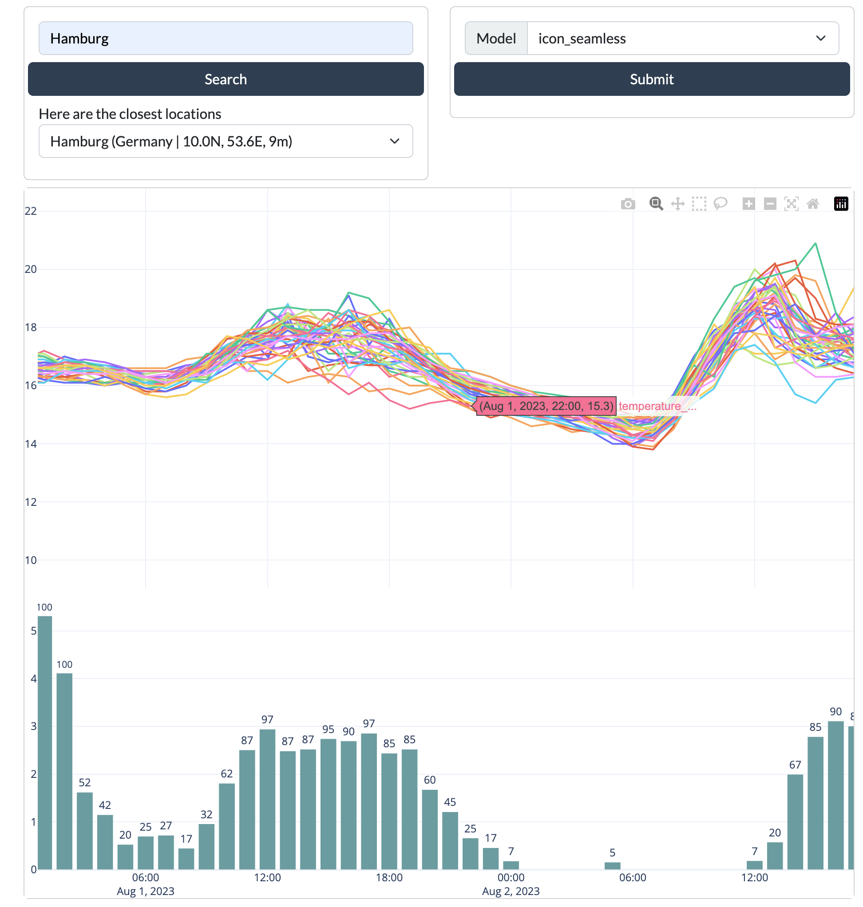

# point_wx

This is a Dash application that uses the open-meteo APIs (https://open-meteo.com/en/docs) to show some interesting plots.



## Installation
Install the requirements

- `dash`
- `dash-bootstrap-components`
- `pandas`
- `plotly`
- `requests`
- `flask-cache`
- `jdcal` for suntimes to work

Sorry, no explicit packaging with `yaml` and/or `requirements.txt` is provided for now.
But since you only need a few packages to make it work, it should be fine. 

## Configuration
You can set the options in `src/utils/settings.py`

- `APP_HOST`, `APP_PORT` will only have effect if you run the `app.py` directly without using another production server like `gunicorn`
- `URL_BASE_PATHNAME` specifies the subfolder where the whole site is running
- `CACHE_TYPE` and `CACHE_DIR` allows you to change the cache behaviour, which is used to save and reuse the results of the function downloading the forecast data in `src/utils/openmeteo_api.py`

## Running
To test just run `python src/app.py`.
To deploy in production something like this should work

```python
gunicorn -b 127.0.0.1:8000 --timeout=90 app:server
```

You can setup a service using `supervisor` and using the following configuration as a `.conf` file

```
[program:point_wx]
directory=/home/ubuntu/point_wx/src/
command=gunicorn -b 127.0.0.1:8000 --timeout=90 app:server
autostart=true
autorestart=true
stopasgroup=true
killasgroup=true
stderr_logfile=/tmp/point_wx.err.log
stdout_logfile=/tmp/point_wx.err.log
```
