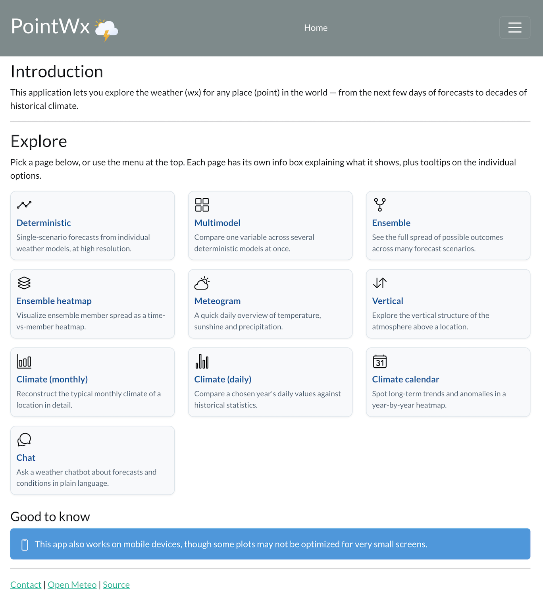
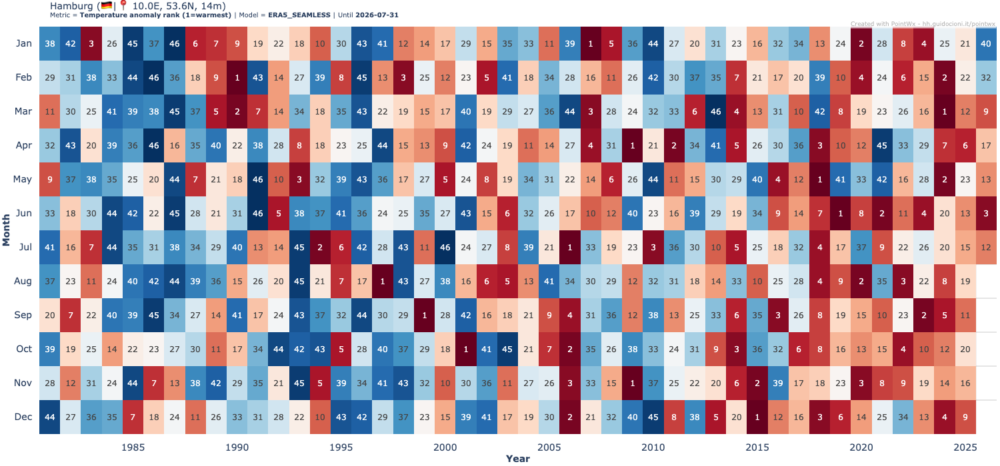
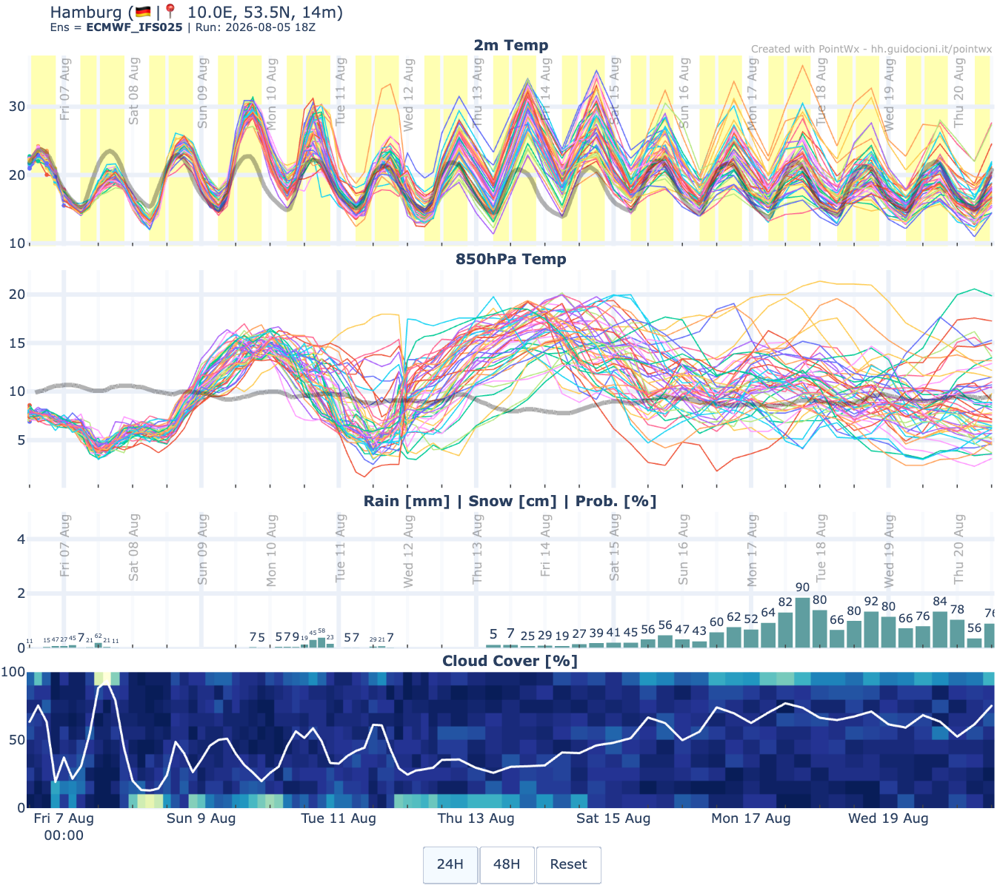
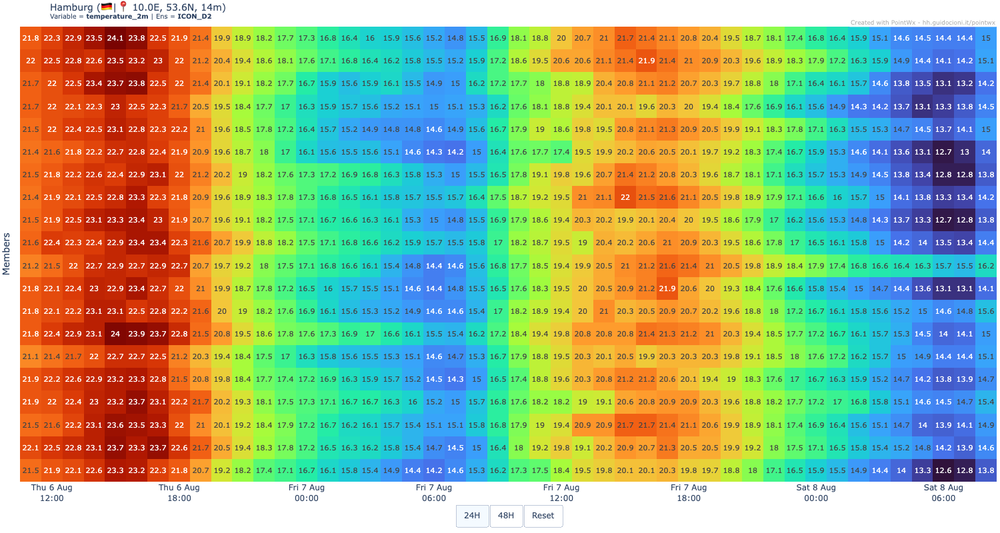
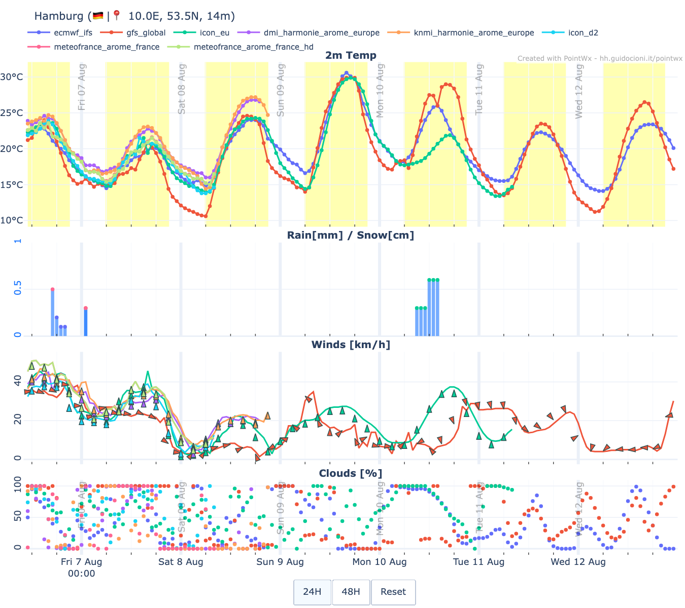
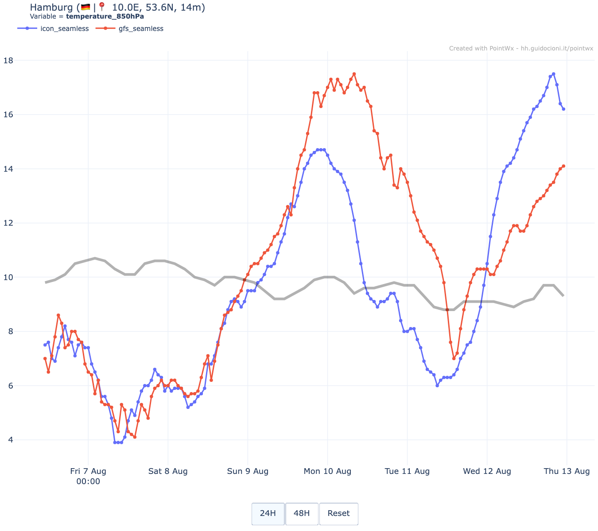
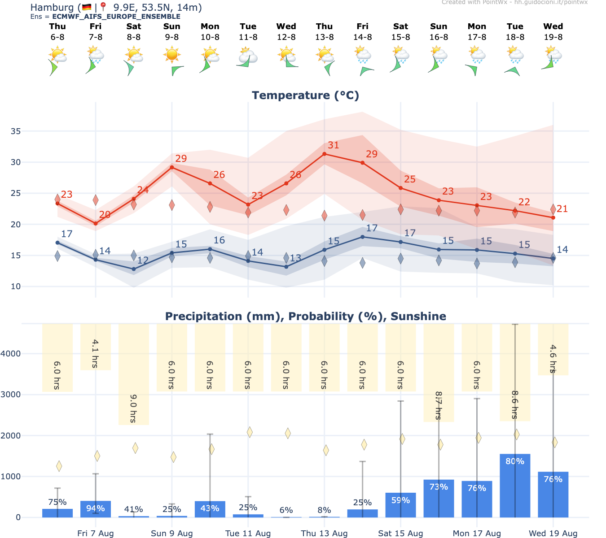
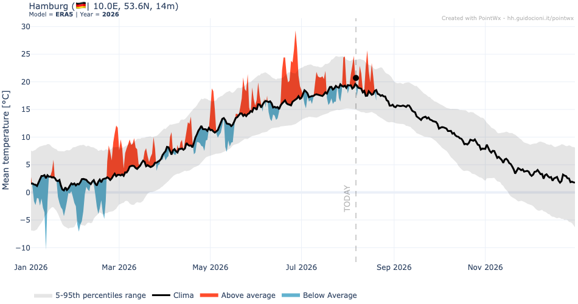
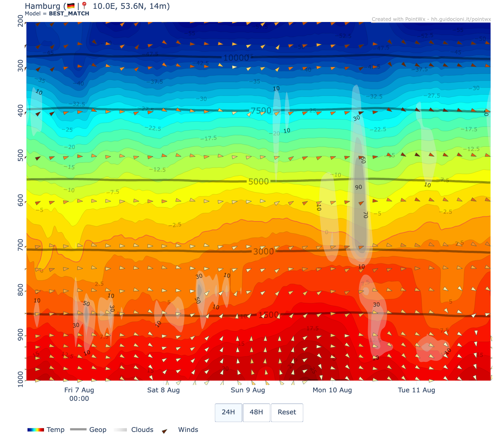

# point_wx

This is a Dash application that uses the open-meteo APIs (https://open-meteo.com/en/docs) to show some interesting plots. The production version runs at https://hh.guidocioni.it/pointwx/.

## Screenshots

<div align="center">



*Main interface showing location selector and model options*



*Climate calendar - temperature anomaly ranking heatmap by month and year*



*Ensemble forecast showing multi-model temperature, precipitation, and cloud cover predictions*



*Hourly temperature heatmap visualization across multiple days*



*Multi-model deterministic forecast comparison for temperature, rain, wind, and clouds*



*Seamless model comparison showing temperature forecast differences*



*Daily meteogram with temperature range, precipitation probability, and sunshine hours*



*Model climate monthly view showing temperature anomalies throughout the year*




*Atmospheric vertical profile with temperature, geopotential, clouds, and wind vectors*

</div>

## Features

- **Multi-page dashboard** with various weather visualizations:
  - Ensemble forecasts with multi-model comparison
  - Deterministic model forecasts
  - Heatmap visualizations for temperature, precipitation, and other variables
  - Meteogram with daily weather overview
  - Vertical atmospheric profiles
  - Climate calendar with historical temperature anomalies
  - AI-powered weather reports and chatbot (optional, requires OpenAI API)
- **Location search** with geocoding via Mapbox API, recent locations saved into cache
- **Persistent session-based figure storage** for seamless navigation (experimental)
- **Comprehensive caching** for improved performance (via `flask-caching`)
- **Support for 60+ weather models** from open-meteo API

## Installation

### Requirements

Install dependencies from `requirements.txt`:

#### Core dependencies:
- `dash` - Web application framework
- `dash-bootstrap-components` - UI styling components
- `dash-mantine-components` - Modern React-based components
- `dash-iconify` - Icon library
- `dash-leaflet` - Interactive maps for location selection
- `flask` - Underlying web server
- `flask-caching` - Caching layer for API responses
- `gunicorn` - Production WSGI server
- `pandas` - Data manipulation
- `plotly` - Interactive plotting library
- `requests` - HTTP library for API calls
- `numpy` - Numerical operations
- `jdcal` - Julian date calculations for sunrise/sunset times
- `pytz` - Timezone handling
- `unidecode` - Unicode text normalization

#### Optional dependencies:
- `openai` - Required for AI weather reports and chatbot functionality (set `OPENAI_KEY` environment variable) 
- `metpy` - to compute vertical parcels
- `xarray` - to add 850hPa temp climatology which is reading a local zarr store (not included here)

## Configuration

Configuration is managed through environment variables. Set these in your shell or systemd service file:

### Required for production:
- `MAPBOX_KEY` - Mapbox API key for geocoding and location search

### Optional:
- `OPENMETEO_KEY` - Commercial open-meteo API key. When set, requests are routed to the commercial endpoint; otherwise the free API is used
- `OPENAI_KEY` - OpenAI API key to enable AI weather reports (`/report` endpoint) and the chatbot page
- `OPENWEATHERMAP_KEY` - Only used for chatbot

### Application settings:
- `APP_PORT` - Port for the development server (default: `8083`). Only applies when running `app.py` directly
- `URL_BASE_PATHNAME` - Base URL path where the app is served (default: `/pointwx/`)
- `CACHE_DIR` - Directory for filesystem cache (default: `/var/cache/pointwx/`). Falls back to system temp directory if not writable
- `CACHE_THRESHOLD` - Maximum number of cached items before eviction (default: `10000`). Sized for many locations × models × variables
- `DISABLE_CACHE` - Set to `true` to disable caching (default: `false`). Useful for development or debugging

## Running

### Development server

For local testing and development:

```bash
python src/app.py
```

The app will be available at `http://localhost:8083/pointwx/` by default.

### Production deployment with systemd

For production deployment, use `gunicorn` with multiple workers and appropriate timeouts. Here's a complete systemd service configuration:

```ini
[Unit]
Description=Gunicorn instance to serve point_wx
After=network.target

[Service]
Type=notify
User=user
Group=group
WorkingDirectory=/home/user/point_wx/src

# Environment variables
Environment="MAPBOX_KEY=<your-mapbox-api-key>"
Environment="OPENMETEO_KEY=<your-openmeteo-commercial-key>"
Environment="OPENAI_KEY=<your-openai-api-key>"
Environment="CACHE_DIR=/var/cache/pointwx/"

# Gunicorn command with optimized settings
ExecStart=/bin/bash -c "source /home/user/miniconda3/bin/activate dash && exec gunicorn \
    -b 127.0.0.1:8000 \
    --workers=4 \
    --timeout=150 \
    --graceful-timeout=60 \
    --max-requests=300 \
    --max-requests-jitter=50 \
    --preload \
    app:server"

# Logging
StandardOutput=append:/var/log/pointwx/point_wx.log
StandardError=append:/var/log/pointwx/point_wx.log

# Restart policy
Restart=on-failure
RestartSec=5

[Install]
WantedBy=multi-user.target
```

#### Gunicorn options explained:

- `--workers=4` - Number of worker processes. Rule of thumb: `2-4 × CPU_CORES`. More workers handle more concurrent requests
- `--timeout=150` - Worker timeout in seconds. Set high enough for slow API requests or complex computations
- `--graceful-timeout=60` - Graceful shutdown timeout. Allows workers to finish current requests before forced termination
- `--max-requests=300` - Restart workers after handling this many requests. Prevents memory leaks from accumulating
- `--max-requests-jitter=50` - Random variance in max-requests. Prevents all workers from restarting simultaneously
- `--preload` - Load application code before forking workers. Reduces memory usage and startup time
- `-b 127.0.0.1:8000` - Bind to localhost (use a reverse proxy like nginx/Apache for external access)

#### Setting up the service:

```bash
# Create log directory
sudo mkdir -p /var/log/pointwx
sudo chown user:group /var/log/pointwx

# Create cache directory
sudo mkdir -p /var/cache/pointwx
sudo chown user:group /var/cache/pointwx

# Install and enable the service
sudo cp point_wx.service /etc/systemd/system/
sudo systemctl daemon-reload
sudo systemctl enable point_wx
sudo systemctl start point_wx

# Check status
sudo systemctl status point_wx
```

### Log rotation

To prevent log files from growing indefinitely, set up logrotate:

Create `/etc/logrotate.d/pointwx`:

```
/var/log/pointwx/*.log {
    daily
    rotate 14
    compress
    delaycompress
    notifempty
    create 0640 user group
    sharedscripts
    postrotate
        systemctl reload point_wx > /dev/null 2>&1 || true
    endscript
}
```

This configuration:
- Rotates logs daily
- Keeps 14 days of logs
- Compresses old logs (but delays compression by one cycle)
- Only rotates if log file is not empty
- Reloads the service after rotation to reopen log files

### Docker deployment (experimental)

Docker support is experimental and may require adjustments for your environment.

Build the image:

```bash
docker build -t pointwx .
```

Run the container:

```bash
docker run -d \
  -p 8083:8000 \
  -e MAPBOX_KEY=<your-mapbox-api-key> \
  -e OPENMETEO_KEY=<your-openmeteo-commercial-key> \
  -e OPENAI_KEY=<your-openai-api-key> \
  -v pointwx-cache:/var/cache/pointwx \
  --name pointwx \
  pointwx
```

The `-v pointwx-cache:/var/cache/pointwx` flag creates a named volume to persist the cache across container restarts.

**Note:** The current Dockerfile uses basic gunicorn settings. For production, consider updating it to match the systemd service configuration above.

## Architecture

### Application structure

- `src/app.py` - Main application entry point. Exposes the `server` object (Flask app) for gunicorn
- `src/pages/` - Self-registering page modules (Dash multi-page framework)
  - Each page lives in its own subdirectory with `__init__.py`, `callbacks.py`, `figures.py`, and `options_selector.py`
  - Pages: `forecasts`, `forecasts_heatmap`, `ensemble`, `ensemble_heatmap`, `meteogram`, `vertical`, `model_climate`, `model_climate_daily`, `climate_calendar`, `chatbot`
- `src/components/` - Shared UI components (location selector, navbar, etc.)
- `src/utils/` - Core functionality
  - `openmeteo_api.py` - Single source for all weather API access (~1200 lines, heavily cached)
  - `settings.py` - Configuration hub, environment variables, model/variable options
  - `custom_theme.py` - Plotly theme definition
  - `ai_utils.py` - OpenAI integration for AI reports
  - `mapbox_api.py` - Geocoding via Mapbox
- `src/assets/` - Static files (CSS, images)

### Data flow

1. User selects location via `location_selector` → stored in `dcc.Store` (`locations-list`, `location-selected`)
2. User selects model/variable via page-specific `options_selector` → triggers callback on Submit
3. Page callback reads from Stores, calls `openmeteo_api.py` function (e.g., `get_forecast_data`)
4. API function fetches from open-meteo, result is `@cache.memoize`d with appropriate TTL
5. Callback returns Plotly figure → rendered in page

### Caching strategy

All API access functions in `src/utils/openmeteo_api.py` are decorated with `@cache.memoize(timeout=...)`:
- **Forecasts**: 10-30 minutes (data updates frequently)
- **Climatology**: 24 hours (static historical data)
- **Model metadata**: 15 minutes (run initialization times)

Cache key includes all function arguments (location, model, variable, time range), ensuring separate cache entries for different queries.

## API Credits

This application uses data from:
- **[open-meteo.com](https://open-meteo.com/)** - Weather forecast and historical data API
- **[Mapbox](https://www.mapbox.com/)** - Geocoding and location search API
- **[OpenAI](https://openai.com/)** - AI-powered weather reports and chatbot (optional)

## Troubleshooting

### Cache issues

If you're seeing stale data or want to clear the cache:

```bash
# Find cache directory (check logs for "Using <path> as cache directory")
# Then remove cache files
rm -rf /var/cache/pointwx/*
```

Or disable cache temporarily:

```bash
DISABLE_CACHE=true python src/app.py
```

### Port already in use

If port 8083 is already in use:

```bash
APP_PORT=8084 python src/app.py
```

### Memory issues with many workers

If you're running out of memory with multiple gunicorn workers:
- Reduce `--workers` count
- Use `--preload` flag to share memory across workers (already in the systemd config)
- Increase `CACHE_THRESHOLD` if cache is evicting too aggressively

### API rate limits

If using the free open-meteo API:
- Requests are cached aggressively to minimize API calls
- Consider getting a commercial API key (`OPENMETEO_KEY`) for higher rate limits
- Check the open-meteo API documentation for current rate limit policies